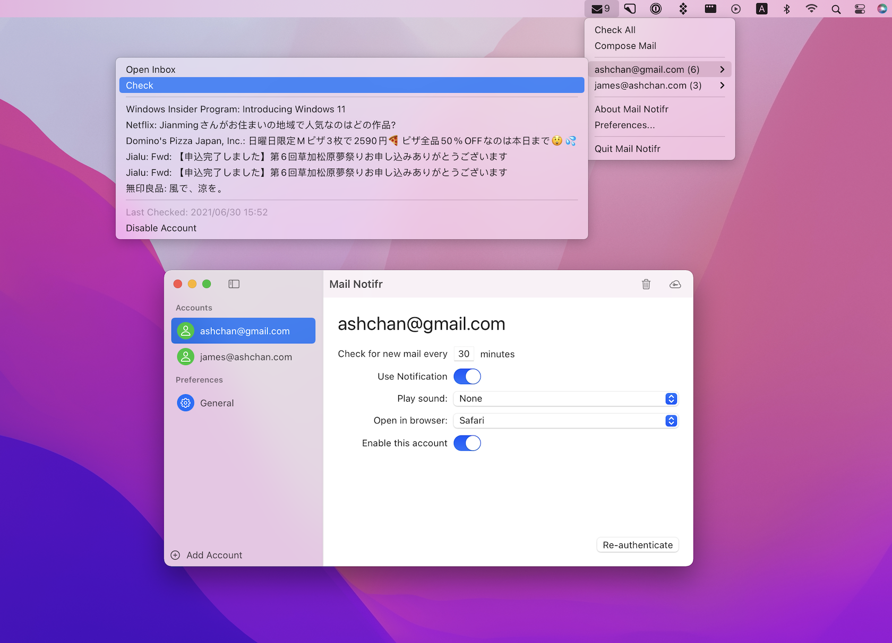

# Mail Notifr (formerly Gmail Notifr) #

A Gmail Notifier for macOS

[Mail Notifr](https://bit.ly/gmail-notifr-store) features:

* Support multiple Google Accounts (OAuth 2.0).
* Separate check and notification setting for each account.
* Preferred browser setting for each account.
* Support Google hosted account.
* Check mail at a specified interval.
* Notification Center &amp; sound notifications.
* Small &amp; fast.
* No background daemon processes installed as Google's official notifier.
* Open Source!
* Free! Install from [Mac App Store](https://bit.ly/gmail-notifr-store).

## Requirements ##

* 2.0.0+: macOS 11 Big Sur or later.
* 1.3.5 and below: macOS 10.8 or later.

## Note ##

Mail Notifr was originally written in RubyCocoa, then MacRuby, then Objective-C, and recently Swift.

* The [MacRuby implementation](https://github.com/ashchan/gmail-notifr) repository remains. I also created a [macruby](https://github.com/ashchan/mail-notifr/tree/macruby) branch.

* The RubyCocoa implementation's on the [rubycocoa](https://github.com/ashchan/mail-notifr/tree/rubycocoa) branch.

## Updates, Changelog &amp; Feedback ##

Feedback is welcome! Leave a message on the [feedback](https://blog.ashchan.com/archive/2008/10/29/gmail-notifr-changelog/) page, or create a github [issue](https://github.com/ashchan/mail-notifr/issues), or tweet the author [@ashchan](https://twitter.com/ashchan).

View the full [changelog](CHANGELOG).

Visit [project home page](https://ashchan.com/projects/gmail-notifr) for more information.

## License ##

[The MIT License](LICENSE)

**Binary or modification is NOT allowed to submit to Apple App Store without written permission!**

Copyright (c) 2008 - 2021 [James Chen](https://ashchan.com/) ([@ashchan](https://twitter.com/ashchan))
